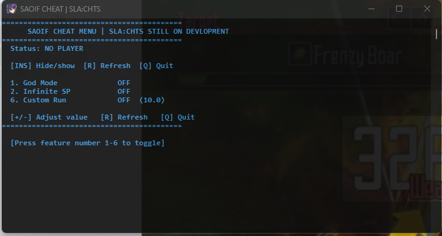

# SAOIF Cheat

A game modification/cheat tool for SAOIF (Sword Art Online: Integral Factor) using DirectX hooking and ImGui.

## Features

- DirectX 11 hooking via Kiero library
- ImGui-based user interface
- IL2CPP integration for game memory manipulation
- Various game features and modifications

## Dependencies

- **Kiero**: DirectX hooking library
- **ImGui**: Immediate mode GUI library
- **MinHook**: Hooking library included with Kiero
- **IL2CPP**: Unity IL2CPP runtime integration

## Building

### Requirements

- Visual Studio 2019 or later
- CMake 3.15 or higher
- Windows SDK

### Build Steps

```bash
mkdir build
cd build
cmake ..
cmake --build . --config Release
```

## Usage

1. Build the project
2. Inject the DLL into the SAOIF game process
3. Use the in-game overlay (typically activated with Insert key)

## Screenshot



## Disclaimer

This tool is for educational purposes only. Use responsibly and at your own risk.

## License

See individual component licenses:
- ImGui: MIT License
- Kiero: MIT License
- MinHook: BSD 2-Clause License
